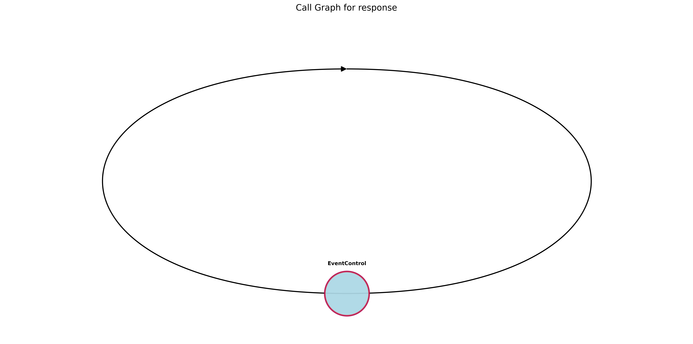
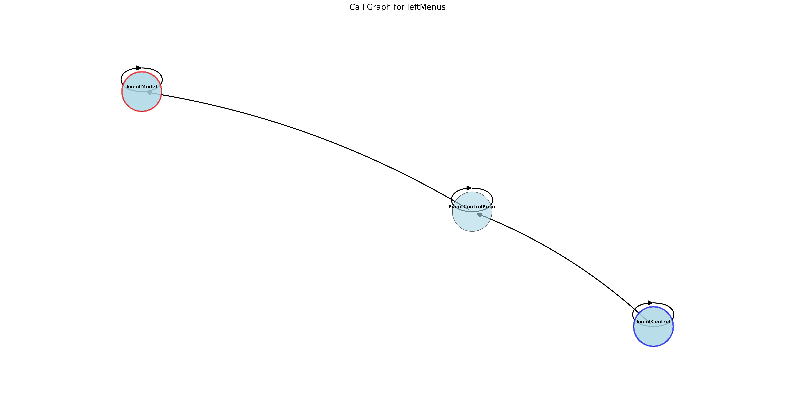
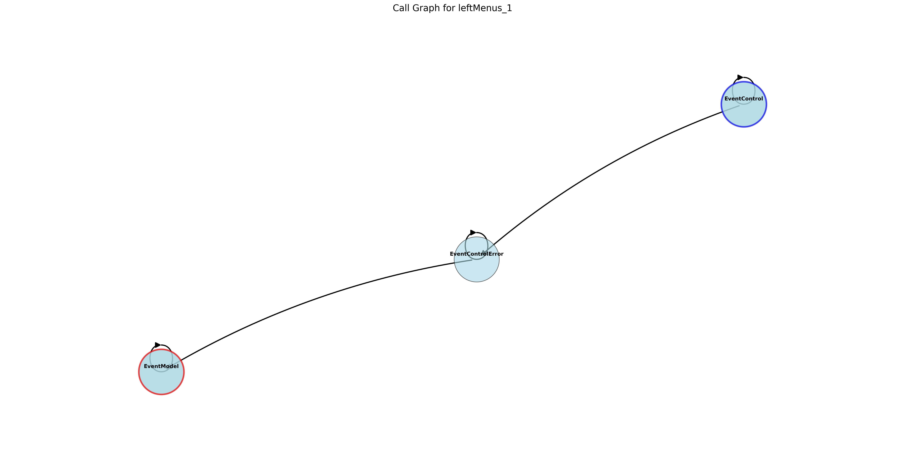
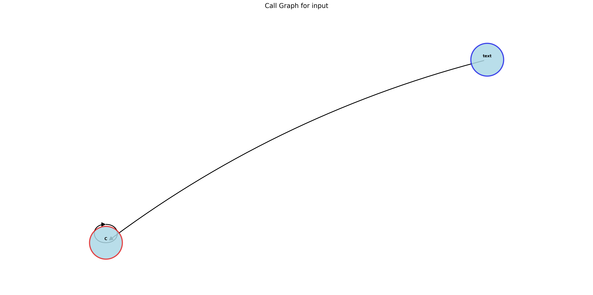
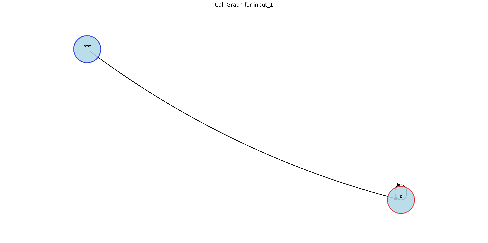
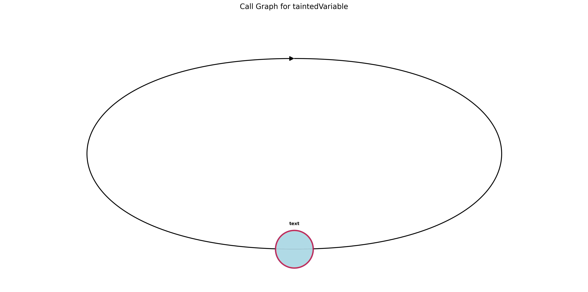
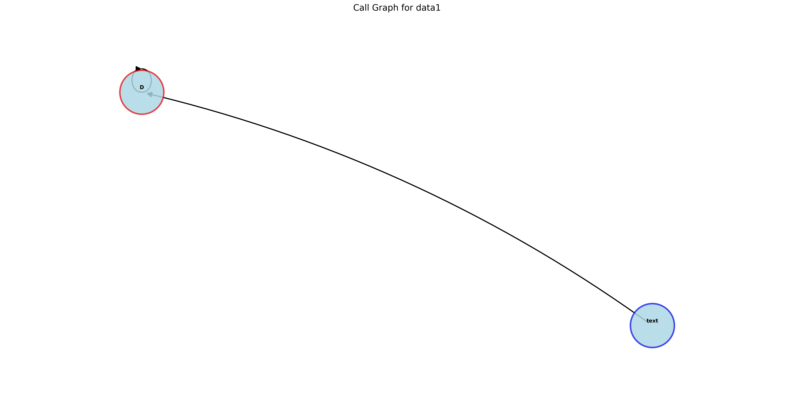
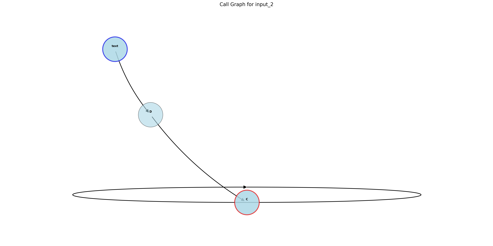

# 결과 보고서
**생성일:** 2024-09-07 13:41:51

**생성 도구:** Taint Bomb

## 목차
- [개요](#개요)
- [콜 그래프](#콜-그래프)
- [상세 분석](#상세-분석)

## 개요
이 보고서는 코드베이스에 대한 분석 결과를 제공하며, 잠재적인 보안 위험과 취약점을 식별합니다.
다음 섹션에는 코드 내에서 오염된 데이터의 흐름을 시각화한 콜 그래프와, 각 오염된 변수에 대한 자세한 정보가 포함되어 있습니다.

## 콜 그래프
아래는 애플리케이션에서 오염된 데이터의 흐름을 나타내는 콜 그래프입니다. 각 그래프 뒤에는 관련된 오염된 변수에 대한 상세 분석이 이어집니다.

### 콜 그래프: `response`


**오염된 데이터의 흐름:**
```text
EventControl -> EventControl -> EventControl
```

### 콜 그래프: `response`


**오염된 데이터의 흐름:**
```text
EventControl -> EventControl
```

### 콜 그래프: `leftMenus`


**오염된 데이터의 흐름:**
```text
EventControl -> EventControl -> EventControlError -> EventControlError -> EventControlError -> EventModel -> EventModel -> EventModel
```

### 콜 그래프: `leftMenus_1`


**오염된 데이터의 흐름:**
```text
EventControl -> EventControl -> EventControlError -> EventControlError -> EventControlError -> EventControlError -> EventControlError -> EventControlError -> EventModel -> EventModel -> EventModel
```

### 콜 그래프: `input`


**오염된 데이터의 흐름:**
```text
text -> C -> C
```

### 콜 그래프: `input_1`


**오염된 데이터의 흐름:**
```text
text -> C -> C
```

### 콜 그래프: `taintedVariable`


**오염된 데이터의 흐름:**
```text
text -> text
```

### 콜 그래프: `data1`


**오염된 데이터의 흐름:**
```text
text -> D -> D
```

### 콜 그래프: `input_2`


**오염된 데이터의 흐름:**
```text
text -> D -> C -> C
```

### 콜 그래프: `input`


**오염된 데이터의 흐름:**
```text
text -> C -> C
```

### 콜 그래프: `input`


**오염된 데이터의 흐름:**
```text
text -> C -> C
```

## 상세 분석
다음 섹션에서는 각 오염된 변수에 대한 자세한 정보와 잠재적인 영향, 권장 완화 방법을 제공합니다.

